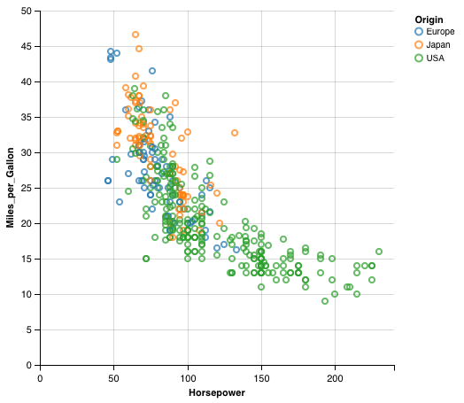

`vegalite` : Do whatever `ggvis` doesn't :-)

For better examples, [take a look here](http://rud.is/projects/vegalite01.html).

The following functions are implemented:

- `add_data`:	Add data to a Vega-Lite spec
- `add_filter`:	Add a filter
- `calculate`:	Derive new fields
- `cell_size`:	Add cell size to main Vega-Lite spec
- `encode_color`:	Encode color "channel"
- `encode_detail`:	Encode detail "channel"
- `encode_shape`:	Encode shape "channel"
- `encode_size`:	Encode size "channel"
- `encode_text`:	Encode text "channel"
- `encode_x`:	Encode x "channel"
- `encode_y`:	Encode y "channel"
- `filter_null`:	Filter 'null' values
- `mark_area`:	Area mark
- `mark_bar`:	Bar mark
- `mark_circle`:	Circle mark
- `mark_line`:	Line mark
- `mark_point`:	Point mark
- `mark_square`:	Square mark
- `mark_text`:	Text mark
- `mark_tick`:	Tick mark
- `renderVegalite`:	Widget render function for use in Shiny
- `saveWidget`:	vegalite exported operators
- `vegalite`:	Create Vega-Lite specs using htmlwidget idioms
- `vegalite-exports`:	vegalite exported operators
- `vegaliteOutput`:	Widget output function for use in Shiny

### DEVELOPMENT NOTES

#### For `ggvega`

>Current thinking is to try to use the `vega-lite` node module "headless" and let it do the transforms (et al) then get the spec back into R and convert to ggplot2.
>
>It turns out that thinking is semi-ok. `vega-lite` will compile to a full Vega spec, but it relies on `vega` to do all the heavy lifting. That's a binary install on most systems.
>
>So, I have to write a parser for the Vega expression language. ugh.

### Installation


```r
devtools::install_github("hrbrmstr/vegalite")
```


### Usage


```r
library(vegalite)

# current verison
packageVersion("vegalite")
```

```
## [1] '0.1.0'
```


```r
library(vegalite)

vegalite() %>% 
  cell_size(400, 400) %>% 
  add_data("https://vega.github.io/vega-editor/app/data/cars.json") %>% 
  encode_x("Horsepower") %>% 
  encode_y("Miles_per_Gallon") %>% 
  encode_color("Origin", "nominal") %>% 
  mark_point()
```


